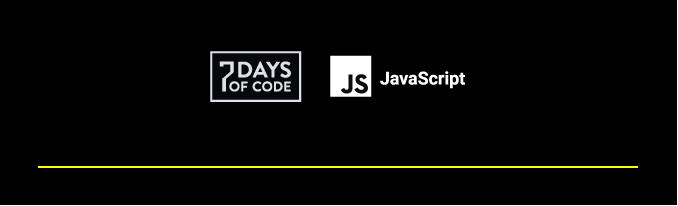

 
<h1>7 DAYS OF CODE 🐱‍👤</h1>
<h2>Programa de Desafios da ALURA🟦</h2>
 

Nos próximos 7 dias serão feitos desafios de Lógica em JS

Para ter mais detalhes sobre cada projeto, visite meu <a style="color: white" href="https://linkedin.com/in/heymatxeus">Linkedin</a🚀 

